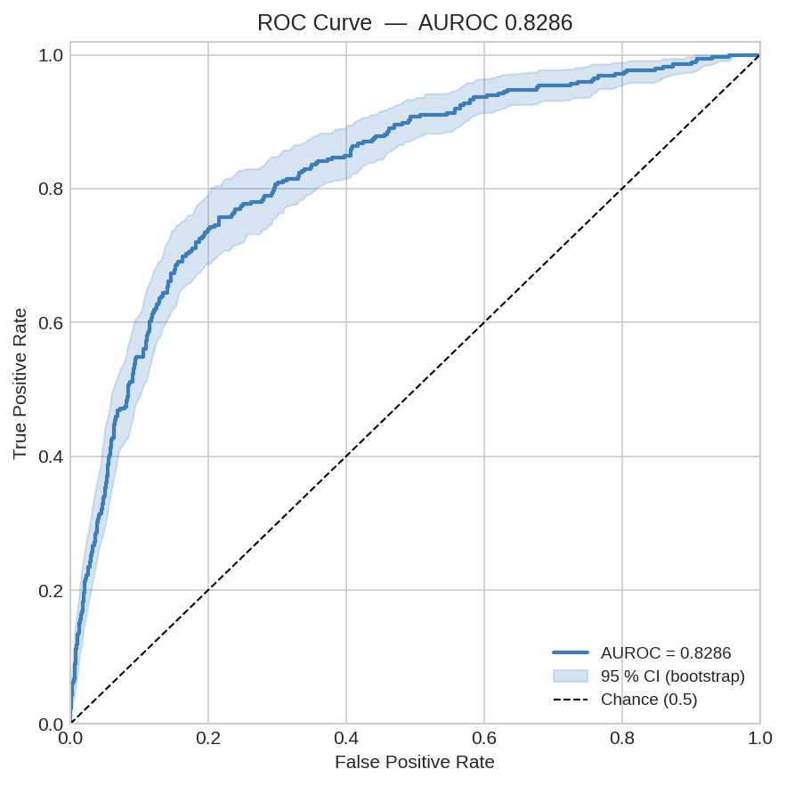
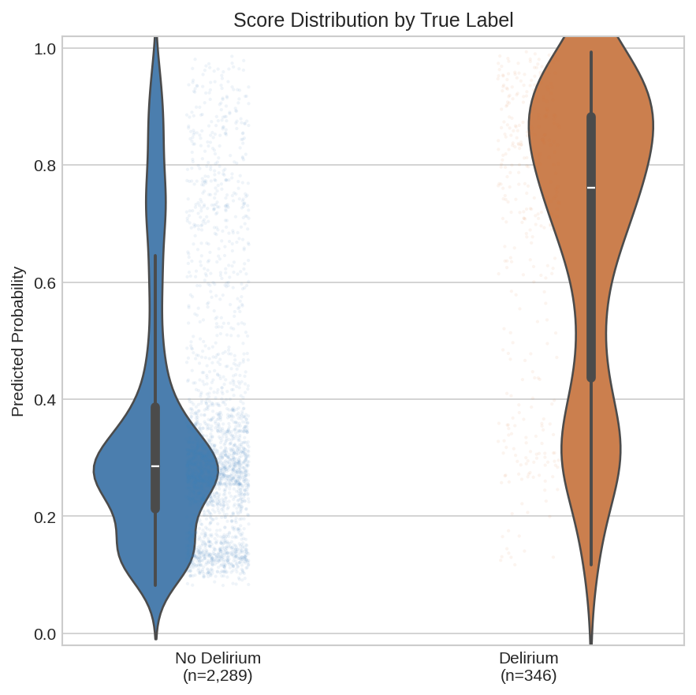

# PULSED: Patch-based Understanding of Longitudinal Signals for EHR Delirium Prediction
## Predicting ICU Delirium Onset from Time Series Using a Lightweight Patch-Based Graph Neural Network on MIMIC-IV

Note: Work still ongoing - exploring interpretability analyses

---
I developed an end-to-end machine learning system that predicts ICU delirium onset from the first 24 hours of physiological monitoring data in MIMIC-IV. The project adapts T-PatchGNN an irregular multivariate time series architecture.

Beyond model training, I engineered a reproducible data pipeline on 26,000+ ICU stays, diagnosed and quantified leakage in assessment features, implemented classical baselines for fair comparison, and am currently developing an interpretability suite to validate that the model learns clinically useful signals.

---

## The Clinical Problem

ICU delirium affects roughly 1 in 3 critically ill patients and is linked to longer stays, higher mortality, and long-term cognitive impairment. Early prediction from routine EHR data could support proactive intervention, but the task is difficult:

- Irregular sampling: vitals, labs, and drug infusions are recorded at different cadences.
- Severe class imbalance: delirium prevalence is ~7–13% depending on cohort definition.
- Label complexity: delirium requires both a positive CAM-ICU screen and an assessable sedation level (RASS >= −3), assessed in structured intervals after an initial observation window.

The task was framed to match published standards - predict onset from hours 0–24, excluding patients who already have delirium, are comatose, or lack sufficient early data.

---

## What was built

### 1. Data pipeline

| Component | Function |
|-----------|--------------|
| `src/cohort.py` | Demographic cohort: first ICU stay, age >= 18, LOS >= 24 h, early-death and comorbidity exclusions |
| `src/features.py` | 57-feature extraction (vitals, labs, sedatives/vasopressors) with label-based drug ID resolution, hourly aggregation, and honest LOCF imputation |
| `src/build_features.py` | End-to-end CLI building feature set |
| `src/data/patch_dataset.py` | Converts long-format hourly data into (V, P, L) patch tensors with three-level masking (point / patch / stay) |

Cohort: 26,345 ICU stays, 3,460 positive (13.1% prevalence)

### 2. Deep learning model (~70K parameters)

Adapted T-PatchGNN for binary classification as a more lightweight and structure option comparing to DeLLiriuM ~ 345M parameters hoping to achieve comparable performance.

```
Raw ICU observations (irregular, multivariate)
    - 8-hour patches per variable (P=3 for a 24h window)
    - TTCN meta-filter encoder (handles variable-length patches + observation masks)
    - Transformer (intra-series temporal dependencies)
    - Adaptive GCN (inter-series correlations)
    - Masked mean pooling -> classification head
```

Design choices:
- `point_mask` from pre-LOCF data so the model distinguishes real observations from forward-filled gaps
- Train-split-only normalization to prevent leakage
- Class-weighted BCE loss for ~13% positive rate

---

## Results held-out test set n = 2,635

Single stratified split (seed 42). Bootstrap 95% CIs from 200 iterations.

### T-PatchGNN deep model (`src/train.py`)

| Config | Test AUROC | 95% CI |
|--------|-----------|--------|
| Full (57 features) | 0.829 | [0.81, 0.85] |
| No CAM/RASS | 0.780 | [0.75, 0.81] |




DeLLiriuM (2025) reports ~78.1 AUROC for structured-EHR deep learning and ~82.5 for a 345M-parameter LLM on external validation. Direct comparison is difficult, but the conservative baseline (~0.80) sits near the structured-EHR bar with a much more efficient model.

---

## Limitations

- Single database, single split: MIMIC-IV only, no external validation. 
- Multi-seed CV has not been performed because of resource constraints

---

## References

- Zhang et al. (2024). *Irregular Multivariate Time Series Forecasting: A Transformable Patching Graph Neural Networks Approach.* ICML 2024. - Architecture source (`readings/zhang24bw.pdf`)
- Contreras et al. (2025). *DeLLiriuM: Using large language models for ICU delirium prediction.* - Clinical benchmark and evaluation protocol (`readings/nihpp-rs7216692v1.pdf`)
